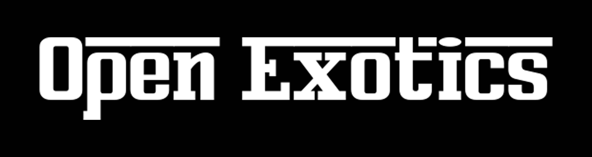
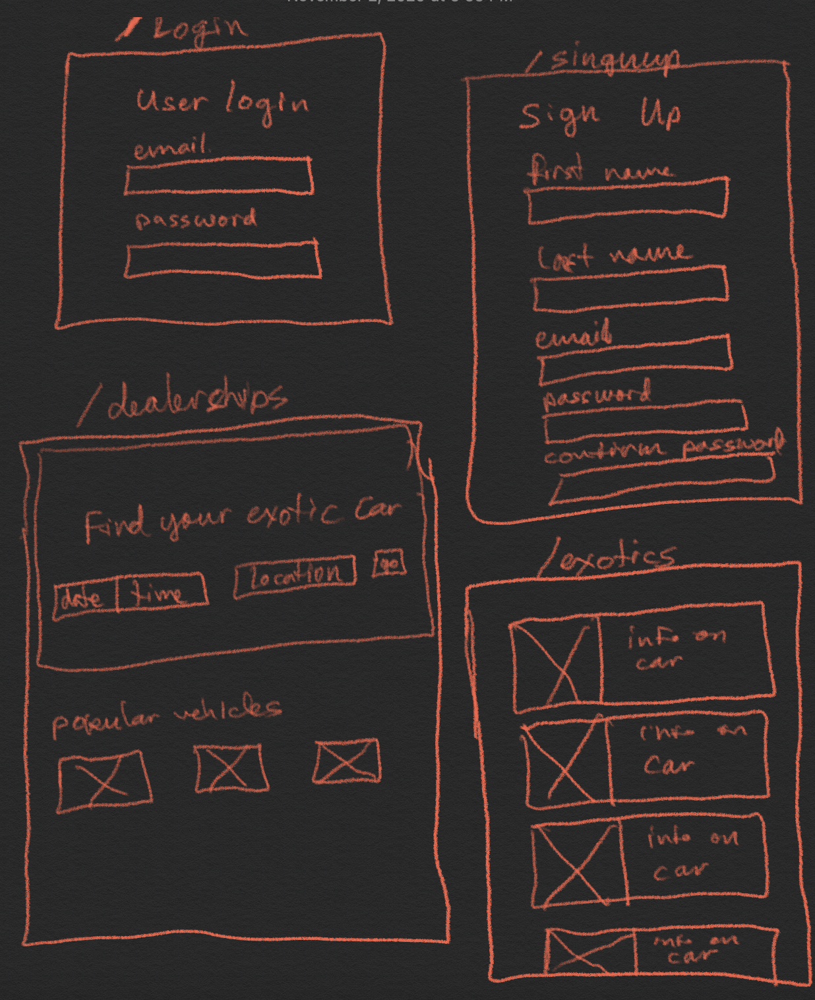

[![LinkedIn][linkedin-shield]][linkedin-url]
[![Portfolio][portfolio-shield]][portfolio-url]
[![Live Link][live-link-shield]][live-link-url]

<br /><br />


<p align="center">
  <a target="_blank" href="https://openexotics.herokuapp.com/">
    
  </a>
</p>

<br />

# About The Project
I created this app based off of Open Table, but with an exotic car twist. A user can browse through different exotic car dealerships to set up a meeting with a sales associate.

<br />

## Built With
I developed this full-stack application using a JavaScript / React frontend and a Python / Flask backend.


<br />

* [React](https://reactjs.org/)
* [Flask](https://flask.palletsprojects.com/en/1.1.x/)
* [WTForms](https://wtforms.readthedocs.io/en/2.3.x/)
* [PostgreSQL](https://www.postgresql.org/)
* [SQLAlchemy](https://www.sqlalchemy.org/)
* [Alembic](https://alembic.sqlalchemy.org/en/latest/)


Deployed with:
* [](https://www.heroku.com/) [Heroku](https://www.heroku.com/)

Packaged with:
* [](https://www.docker.com/) [Docker](https://www.docker.com/)

<br />


----------------

## Features - MVP
- [ ] Login / user auth
- [ ] Dealerships page
- [ ] Reservations
- [ ] Search
- [ ] Signup
Bonus:
- [ ] Ratings/reviews

<br />

## Tables
- Users
    -id
    -username
    -password
    -email
- Dealerships
    -id
    -location
    -bio
- Reservations
   - id
   - user_id (FK)
   - dealership_id (FK)
   - start_time


<br />

# Wireframes




# Flask React Project

This is the backend for the Flask React project.

## Getting started

1. Clone this repository (only this branch)

```bash
git clone https://github.com/appacademy-starters/react-project-starter.git --branch flask-project-starter --single-branch
```

2. Install dependencies
   ```bash
   pipenv install --dev -r dev-requirements.txt --python=python3 && pipenv install -r requirements.txt
   ```

3. Create a **.env** file based on the example with proper settings for your
   development environment
4. Setup your PostgreSQL user, password and database and make sure it matches your **.env** file

5. Get into your pipenv, seed your database, and run your flask app

   ```bash
   pipenv shell
   ```

   ```bash
   python -m database && flask run
   ```
6. To run the React App in development, checkout the [README](./client/README.md) inside the client directory.


***
*IMPORTANT!*
   If you add any python dependencies to your pipfiles, you'll need to regenerate your requirements.txt before deployment.
   You can do this by running:
   ```bash
   pipenv lock -r > requirements.txt
   ```

*ALSO IMPORTANT!*
   psycopg2-binary MUST remain a dev dependency because you can't install it on apline-linux.
   There is a layer in the Dockerfile that will install psycopg2 (not binary) for us.
***


## Deploy to Heroku

1. Create a new project on Heroku
2. Under Resources click "Find more add-ons" and add the add on called "Heroku Postgres"
3. Install the [Heroku CLI](https://devcenter.heroku.com/articles/heroku-command-line)
4. Run
   ```bash
   heroku login
   ```
5. Login to the heroku container registry
   ```bash
   heroku container:login
   ```
6. Update the `REACT_APP_BASE_URL` variable in the Dockerfile.
   This should be the full URL of your Heroku app: i.e. "https://flask-react-aa.herokuapp.com"
7. Push your docker container to heroku from the root directory of your project.
   This will build the dockerfile and push the image to your heroku container registry
   ```bash
   heroku container:push web -a {NAME_OF_HEROKU_APP}
   ```
8. Release your docker container to heroku
   ```bash
   heroku container:release web -a {NAME_OF_HEROKU_APP}
   ```
9. set up your database:
   ```bash
   heroku run -a {NAME_OF_HEROKU_APP} python -m database
   ```
10. Under Settings find "Config Vars" and add any additional/secret .env variables.
11. profit


<br />

-----------------------

## Contact

Andrea Jackson - [@andrea-jackson1](https://www.linkedin.com/in/andrea-jackson1/) - andreajackson1109@gmail.com

Portfolio: [https://andreagjackson.com/](https://andreagjackson.com/)

Live Link: [https://openexotics.herokuapp.com/](https://openexotics.herokuapp.com/)

Project Link: [https://github.com/aganesh0988/OpenExotics](https://github.com/aganesh0988/OpenExotics)


[linkedin-shield]: https://img.shields.io/badge/-LinkedIn-red.svg?style=for-the-badge&logo=linkedin&colorB=red
[linkedin-url]: https://www.linkedin.com/in/andrea-jackson1/
[portfolio-shield]: https://img.shields.io/badge/-Portfolio-red?style=for-the-badge&logo=red
[portfolio-url]:https://andreagjackson.com/
[live-link-shield]: https://img.shields.io/badge/-LiveLink-red?style=for-the-badge&logo=red
[live-link-url]: https://openexotics.herokuapp.com/
